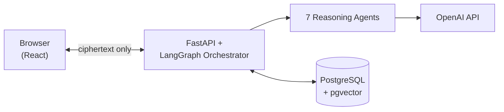

# PayNexus

> "Your pay, explained. Your finances, guided."

A multi-agent agentic AI system for salaried employees in India — not a chatbot, a coordinated team
of seven specialized reasoning agents behind a LangGraph orchestrator, covering payslips, tax
regulation, spending, budgeting, and savings goals in one place.

**V1** (payslip + tax regulation only, 3 agents) is live: [nice-desert-0837ea310.7.azurestaticapps.net](https://nice-desert-0837ea310.7.azurestaticapps.net)
· `paynexus-api.azurewebsites.net` (backend API).
**V2** (this branch, `v2-dev`) adds bank statements, budgeting, savings goals, and scenario
planning — built, tested, and live-verified end to end. Deployed to its own, separate Azure
resources (own App Service, own Static Web App, own database) rather than merged to `main`, so it
never touches V1's production traffic: [ambitious-pebble-083cdaf10.7.azurestaticapps.net](https://ambitious-pebble-083cdaf10.7.azurestaticapps.net)
· `paynexus-api-v2.azurewebsites.net` (backend API).

## Architecture

Two things drive most of the design decisions below: **every number a user sees traces to a Python
function, never an LLM's arithmetic** (tax slabs, deduction gaps, trends, overspending, goal
progress — computed once, quoted by whichever agent needs them), and **the server never sees
plaintext financial data** — payslip, financial-profile, bank-statement, goal, and budget rows are
all AES-256-GCM ciphertext end to end, encrypted/decrypted only in the browser.



The Orchestrator (LangGraph `StateGraph`) classifies each question and fans it out — in parallel —
to whichever of the seven agents actually apply; a payslip question hits one agent, "which regime
should I pick and how much would I save, and am I still on budget" might hit four. Requests that
try to add/edit/delete saved data through chat (not a question, an instruction) are caught by a
dedicated no-LLM capability-gap node instead of being silently misrouted or hallucinated as done.

| Agent | Model | Job |
|---|---|---|
| Payslip Reasoning | GPT-4o | Explains a specific payslip's numbers — accuracy over cost, since a wrong tax figure directly misleads someone |
| Regulatory Intelligence | Hybrid (GPT-4o-mini / local Ollama) | Rule/threshold questions, grounded in `rag_documents/` via pgvector retrieval — never sees the user's actual salary |
| Savings Advisor (Nudge) | Hybrid | Cross-session pattern recognition — deduction headroom, trends, regime timing — using compressed session history |
| SpendingAnalyser | Hybrid | Bank-statement transactions: category breakdowns, recurring merchants, the subscriptions-specific filter |
| BudgetPlanner | Hybrid | Actual spend vs. saved per-category budget targets — period-prorated so a statement longer than a month doesn't falsely read as overspending |
| GoalTracker | Hybrid | Savings-goal progress and whether the current pace hits a target date |
| Foresight (What-If) | Hybrid | Explicit hypotheticals — "what if I switched regime / cut my budget by ₹1,000 / saved ₹500 more toward a goal" |

A user never has to ask to be warned, either — client-side, no-LLM proactive alerts (ITR deadline,
regime-declaration window, deduction headroom, stale payslip/statement, over-budget category,
approaching goal deadline) surface unprompted as dismissible banners, dismissal scoped per-day per
alert via `localStorage`.

## Deployment

| Resource | What | Where |
|---|---|---|
| `paynexus-api` | V1 backend, Docker container | Azure App Service (Basic B1, `indiasouthcentral`) |
| `paynexus-api-v2` | V2 backend, Docker container — **same App Service Plan as V1** (shared B1 compute, no extra plan cost) | Azure App Service (Basic B1, `indiasouthcentral`) |
| `paynexus-web` | V1 frontend | Azure Static Web Apps (Free tier) |
| `paynexus-web-v2` | V2 frontend | Azure Static Web Apps (Free tier) |
| `paynexus-db-ramya` | PostgreSQL 16 + `pgvector`, separate `paynexus` (V1) / `paynexus_v2` (V2) databases on the same server | Azure Database for PostgreSQL Flexible Server (Burstable B1MS) |
| `ramya192/paynexus-backend` | Backend container image — `:latest`/`:<sha>` tags for V1, `:v2-latest`/`:v2-<sha>` for V2, same repo | Docker Hub (free tier) |

CI/CD: two independent workflows, so V1's and V2's deploys can never cross-trigger each other —
`.github/workflows/deploy.yml` (pushes to `main` → `paynexus-api`/`paynexus-web`) and
`.github/workflows/deploy-v2.yml` (pushes to `v2-dev` → `paynexus-api-v2`/`paynexus-web-v2`). Each
backend job builds+pushes its own image tag to Docker Hub; each App Service has its own Continuous
Deployment webhook that re-pulls automatically on a push to its own tag. This is also why V2 has
its *own* separate database (`paynexus_v2`) rather than sharing V1's live one — V2's still-evolving
feature set writing into the same store V1's real users are on would be a real data-integrity risk,
not just a deploy-pipeline one. Real ongoing cost: **~$34/month** (Postgres + one shared App Service
Plan; Static Web Apps and Docker Hub are free, and a second App Service on the *same* Basic B1 plan
doesn't add plan cost, just shares its compute), currently running against a $200 Azure free-trial
credit with a hard spending limit (no card can be charged).

**Account Aggregator (AA) integration** — automatic bank-statement fetch via Setu/FinVu — was
built and tested against both providers' real API contracts, then removed entirely rather than
shipped unusable: both require FIU registration with RBI/SEBI/IRDAI (Setu additionally gates its
KYC step on a GSTIN), a structural requirement for registered financial institutions that doesn't
have a self-serve path for an individual developer. Bank statements are uploaded manually (CSV or
PDF, parsed client-side/server-side with no AA dependency) instead — a known, defensible scope
limitation, not a bug.

## Stack

| Area | Choice | Why |
|---|---|---|
| Orchestration | LangGraph `StateGraph` | Typed state, conditional routing, parallel agent fan-out |
| Frontend | React 19 + TypeScript + Vite | Current stable, fast dev loop |
| Styling | Tailwind v4, CSS-first via `@theme` | No separate config file, current major version |
| Frontend state | Zustand | One small store per concern (auth, chat, goals, budget, statements, alerts UI, …) |
| Encryption | Client-side AES-256-GCM (PBKDF2-derived key) | Server never sees plaintext financial data |
| Vector store | pgvector on the same Postgres instance | One database instead of a separate vector service |
| LLM provider | OpenAI (GPT-4o / GPT-4o-mini), local Ollama fallback for hybrid agents | Direct API access, existing paid plan |
| Statement ingestion | CSV parsed directly (no LLM); PDF text extracted client-side (pdfjs-dist) and structured via GPT-4o | The PDF itself never reaches the server, only extracted text does |

## Testing

- **`backend/tests/`** — 265 pytest tests, zero setup (`cd backend && pytest`) — unit tests covering
  every concrete bug this build found across both V1 and V2 (tax slab math, deduction gaps, trends,
  compression, table dedup, budget period-proration, duplicate-transaction-ID disambiguation,
  Ollama's markdown-fence JSON issue), plus `@pytest.mark.integration` tests that hit the real
  OpenAI API.
- **`backend/rag/eval.py`** — retrieval hit-rate@k, MRR, and generation keyword-coverage against a
  hand-verified ground-truth set. Current: 94% hit-rate, 0.853 MRR, 100% keyword coverage.
- **`backend/agent_eval/eval.py`** — the same keyword-coverage approach for narrated agent answers,
  plus forbidden-phrase checks for this build's recurring failure mode (a confidently *wrong*
  conclusion stated despite correct numbers in the same prompt).
- **`backend/compression/eval.py`** — real before/after token-cost measurement for context
  compression (Level 1 in-session sliding window, Level 2 cross-session summarization).
- **`.claude/skills/run-paynexus/`** — the agent-facing runbook: direct Python invocation, `curl`
  recipes, and Playwright drivers (`driver.mjs` for V1's flow, `v2_flows_driver.mjs` +
  `v2_flows_driver_part2.mjs` for V2's — registration through every CRUD flow, proactive alerts,
  the subscriptions filter, capability-gap responses, and cross-session memory, verified against
  the real network request, not LLM wording).

## Layout

```
paynexus-v2/
├── backend/
│   ├── agents/          LangGraph orchestrator + 7 reasoning agents
│   ├── agent_eval/       answer-quality eval harness
│   ├── analytics/        spending trends, recurring-merchant/subscriptions detection
│   ├── budgeting/        budget vs. actual-spend checks
│   ├── categorization/   rule-based transaction categorization (+ LLM fallback)
│   ├── ingestion/        CSV statement parsing
│   ├── rag/              retriever, index builder, eval harness
│   ├── compression/      context compression + its eval harness
│   ├── security/         auth, password hashing
│   ├── db/                SQLAlchemy models, session handling
│   ├── tests/             265 pytest tests
│   ├── alembic/          migrations — alembic upgrade head before first run
│   ├── Dockerfile         real, tested container for App Service
│   └── ...                FastAPI app, statement/payslip extraction, tax computation modules
├── frontend/              React 19 + TypeScript + Tailwind v4 (Vite)
│   └── src/components/    Auth, Dashboard (tabs), Chat, ChatWidget, Alerts, GoalTracker,
│                          BudgetPlanner, StatementUploader, PayslipUploader, FinancialProfile
├── rag_documents/         Indian tax-law source docs embedded into pgvector
├── .claude/skills/run-paynexus/   agent-facing runbook — direct invocation, curl, Playwright
└── .github/workflows/     CI/CD to Azure (Docker Hub + Static Web Apps) — watches `main` only
```

## Quick start

Needs `backend/.env` filled in (copy `backend/.env.example`) — `OPENAI_API_KEY` and a `DATABASE_URL`
pointing at a Postgres with the `vector` extension enabled (`CREATE EXTENSION IF NOT EXISTS vector;`).

```bash
# backend
cd backend
python -m venv .venv && .venv\Scripts\activate
pip install -r requirements.txt
alembic upgrade head        # schema setup — required once, before first run
python -m rag.build_index   # only needed once, or after editing rag_documents/
uvicorn api.main:app        # no --reload — see .claude/skills/run-paynexus/SKILL.md Gotchas

# frontend
cd frontend
npm install
npm run dev
```
