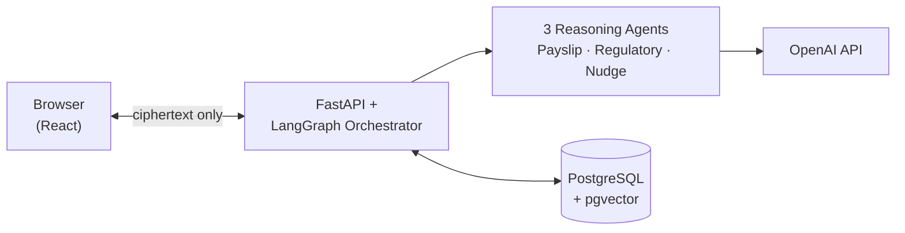

# PayNexus

> "Your pay, explained. Your finances, guided."

A multi-agent agentic AI system that helps salaried employees in India understand their payslip, tax
regime, and financial decisions — not a chatbot, a coordinated team of three specialized reasoning agents
behind a LangGraph orchestrator.

**Live**: [nice-desert-0837ea310.7.azurestaticapps.net](https://nice-desert-0837ea310.7.azurestaticapps.net)
(frontend) · `paynexus-api.azurewebsites.net` (backend API)

**V2** — a larger 7-agent version adding bank statements, budgeting, savings goals, and scenario
planning on top of this same payslip/tax core — is live separately at
[ambitious-pebble-083cdaf10.7.azurestaticapps.net](https://ambitious-pebble-083cdaf10.7.azurestaticapps.net)
· `paynexus-api-v2.azurewebsites.net`, built on the `v2-dev` branch of the same repo
([`Ramya192/pay-nexus`](https://github.com/Ramya192/pay-nexus/tree/v2-dev)).

## Architecture

Two things drive most of the design decisions below: **every number a user sees traces to a Python
function, never an LLM's arithmetic** (tax slabs, deduction gaps, trends — computed once, quoted by
whichever agent needs them), and **the server never sees plaintext financial data** — payslip and
financial-profile rows are AES-256-GCM ciphertext end to end, encrypted/decrypted only in the browser.



The Orchestrator (LangGraph `StateGraph`) reads each question and routes it to whichever of the three
agents actually apply — a payslip question hits one agent, "which regime should I pick and how much would
I save" might hit all three. Their responses get merged and shown together.

| Agent | Model | Job |
|---|---|---|
| Payslip Reasoning | GPT-4o | Explains a specific payslip's numbers — accuracy over cost, since a wrong tax figure directly misleads someone |
| Regulatory Intelligence | Hybrid (GPT-4o-mini / local Ollama) | Answers rule/threshold questions, grounded in `rag_documents/` via pgvector retrieval — never sees the user's actual salary |
| Savings Advisor (Nudge) | Hybrid | Cross-session pattern recognition — deduction headroom, trends, regime timing — using compressed session history |

## Deployment

| Resource | What | Where |
|---|---|---|
| `paynexus-api` | FastAPI backend, Docker container | Azure App Service (Basic B1, `indiasouthcentral`) |
| `paynexus-web` | React frontend | Azure Static Web Apps (Free tier) |
| `paynexus-db-ramya` | PostgreSQL 16 + `pgvector` | Azure Database for PostgreSQL Flexible Server (Burstable B1MS) |
| `ramya192/paynexus-backend` | Backend container image | Docker Hub (free tier) |

CI/CD: `.github/workflows/deploy.yml` — pushes to `main` build+push the backend image to Docker Hub (Azure's
Continuous Deployment webhook then re-pulls it automatically) and build+deploy the frontend to Static Web
Apps. The webhook needs "SCM Basic Auth Publishing Credentials" enabled on the App Service (Settings →
Configuration) to even retrieve its own URL from Deployment Center — found disabled (silently breaking
auto-deploy) and re-enabled 2026-08-17, re-verified against a real push after. Real ongoing cost:
**~$34/month** (Postgres + App Service; Static Web Apps and Docker Hub are free), currently running
against a $200 Azure free-trial credit with a hard spending limit (no card can be charged).

## Stack

| Area | Choice | Why |
|---|---|---|
| Orchestration | LangGraph `StateGraph` | Typed state, conditional routing, parallel agent fan-out |
| Frontend | React 19 + TypeScript + Vite | Current stable, fast dev loop |
| Styling | Tailwind v4, CSS-first via `@theme` | No separate config file, current major version |
| Frontend state | Zustand | Minimal boilerplate for chat/session state |
| Encryption | Client-side AES-256-GCM (PBKDF2-derived key) | Server never sees plaintext financial data |
| Vector store | pgvector on the same Postgres instance | One database instead of a separate vector service |
| LLM provider | OpenAI (GPT-4o / GPT-4o-mini), local Ollama fallback for two agents | Direct API access, existing paid plan |

## Testing

- **`backend/tests/`** — 106 pytest tests, zero setup (`cd backend && pytest`). 97 pure unit tests covering
  every concrete bug this build found (tax slab math, deduction gaps, trends, compression, table dedup,
  Ollama's markdown-fence JSON issue); 4 `@pytest.mark.integration` tests that hit the real OpenAI API.
- **`backend/rag/eval.py`** — retrieval hit-rate@k, MRR, and generation keyword-coverage against a
  hand-verified ground-truth set. Current: 94% hit-rate, 0.853 MRR, 100% keyword coverage.
- **`backend/agent_eval/eval.py`** — the same keyword-coverage approach for the Payslip/Nudge agents'
  actual narrated answers, plus forbidden-phrase checks for this build's recurring failure mode (a
  confidently *wrong* conclusion stated despite correct numbers in the same prompt).
- **`backend/compression/eval.py`** — real before/after token-cost measurement for context compression.
- **`.claude/skills/run-paynexus/`** — the agent-facing runbook: direct Python invocation, `curl` recipes,
  and a Playwright driver (`driver.mjs`) that can target either localhost or the real deployed URLs.

## Layout

```
paynexus/
├── backend/
│   ├── agents/        LangGraph orchestrator + 3 reasoning agents
│   ├── agent_eval/     answer-quality eval for Payslip/Nudge agents
│   ├── rag/            retriever, index builder, eval harness
│   ├── compression/    context compression + its eval harness
│   ├── tests/           106 pytest tests
│   ├── alembic/        migrations — alembic upgrade head before first run
│   ├── Dockerfile       real, tested container for App Service
│   └── ...              FastAPI app, DB models, security, tax computation modules
├── frontend/            React 19 + TypeScript + Tailwind v4 (Vite)
├── rag_documents/       10/10 Indian tax-law source docs embedded into pgvector
├── .claude/skills/run-paynexus/   agent-facing runbook — direct invocation, curl, Playwright
└── .github/workflows/    CI/CD to Azure (Docker Hub + Static Web Apps)
```

## Quick start

Needs `backend/.env` filled in (copy `backend/.env.example`) — `OPENAI_API_KEY` and a `DATABASE_URL`
pointing at a Postgres with the `vector` extension enabled (`CREATE EXTENSION IF NOT EXISTS vector;`).

```bash
# backend
cd backend
python -m venv .venv && .venv\Scripts\activate
pip install -r requirements.txt
alembic upgrade head        # schema setup — required once, before first run
python -m rag.build_index   # only needed once, or after editing rag_documents/
uvicorn api.main:app        # no --reload — see .claude/skills/run-paynexus/SKILL.md Gotchas

# frontend
cd frontend
npm install
npm run dev
```
