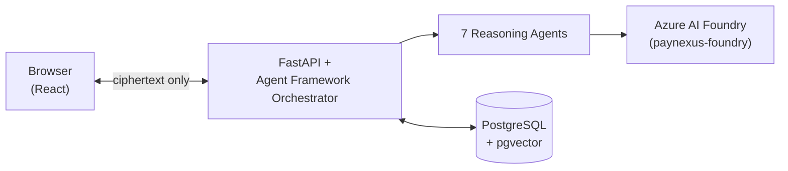

# PayNexus

> "Your pay, explained. Your finances, guided."

A multi-agent agentic AI system for salaried employees in India — not a chatbot, a coordinated team
of seven specialized reasoning agents behind an orchestrator, covering payslips, tax regulation,
spending, budgeting, and savings goals in one place.

**V1** (payslip + tax regulation only, 3 agents) is live: [nice-desert-0837ea310.7.azurestaticapps.net](https://nice-desert-0837ea310.7.azurestaticapps.net)
· `paynexus-api.azurewebsites.net` (backend API, currently stopped to consolidate hosting cost).
**V2** added bank statements, budgeting, savings goals, and scenario planning — built, tested, and
live-verified end to end. Deployed to its own, separate Azure resources (own App Service, own
Static Web App, own database) rather than merged to `main`, so it never touches V1's production
traffic: [ambitious-pebble-083cdaf10.7.azurestaticapps.net](https://ambitious-pebble-083cdaf10.7.azurestaticapps.net)
· `paynexus-api-v2.azurewebsites.net` (backend API).
**V2.1** (this worktree, `foundry-v2`) is an agent-layer-only migration of V2's orchestrator from
LangGraph to Microsoft's **Agent Framework**, running against **Azure AI Foundry** (the
`paynexus-foundry` project) instead of calling OpenAI directly — the FastAPI app, auth, and
encrypted CRUD are untouched. **`foundry-v2` is the sole active branch and what the V2 Azure
resources above actually run.** See [Agent Framework migration](#agent-framework-migration-v21)
below for the full story.

## The story so far: V1 → V2 → V2.1

**V1** shipped first, and stayed small on purpose: 3 agents (Payslip, Regulatory, Nudge), LangGraph
orchestrator, OpenAI called directly. It's still live, on `main`, untouched by everything below.

**V2** started as a genuine question: could this same architecture carry a much bigger scope —
bank statements, budgeting, savings goals, scenario planning — without redesigning the
orchestration layer? It could. Built as its own branch (`v2-dev`) and its own Azure resources
(never merged to `main`, so V1's production traffic was never at risk while V2 was still
"still-evolving"), V2 grew to 7 agents on the exact same LangGraph `StateGraph` + direct-OpenAI
design V1 used, plus a client-side proactive-alerts layer V1 never had. It shipped, was
live-verified end to end, and ran in production for weeks.

**V2.1** started as a deliberate, portfolio-motivated question of its own, with no deadline
pressure: could V2's *same 7 agents* run on Microsoft's Agent Framework against Azure AI Foundry
instead — a stronger interview story than "yet another LangGraph app," and closer to what
enterprise Azure shops actually reach for? Scoped tightly to the agent layer only (FastAPI, auth,
and encrypted CRUD untouched) so the answer could be proven without re-risking everything V2 had
already gotten right. It could — genuinely wired into the live `/chat` endpoint, not a spike — and
then kept growing past pure parity: a live orchestration deadlock found and fixed against the real
running server, a self-updating RAG web-search fallback, capacity-aware context compression, and
every V2 feature request that came in afterward (manual cash entry, credit-card billing-cycle
tracking) landed here instead of on `v2-dev`.

Once V2.1 had genuinely caught up feature-for-feature and then kept going, `v2-dev` became pure
overhead — two branches to keep in sync for one product. It was deleted from GitHub on
2026-09-13, and this branch (then still named `foundry-v3`, a name that made sense when a
`v2-dev` existed to disambiguate from) was renamed to `foundry-v2` the same day: PayNexus V2's
one and only branch now, full stop.

## Architecture

Two things drive most of the design decisions below: **every number a user sees traces to a Python
function, never an LLM's arithmetic** (tax slabs, deduction gaps, trends, overspending, goal
progress — computed once, quoted by whichever agent needs them), and **the server never sees
plaintext financial data** — payslip, financial-profile, bank-statement, goal, and budget rows are
all AES-256-GCM ciphertext end to end, encrypted/decrypted only in the browser.



The Orchestrator (`agents/orchestrator_v2.py` — Microsoft Agent Framework's `ConcurrentBuilder`, as
of the V2.1 migration below) classifies each question and fans it out — concurrently — to whichever
of the seven agents actually apply; a payslip question hits one agent, "which regime should I pick
and how much would I save, and am I still on budget" might hit four. Requests that try to add/edit/
delete saved data through chat (not a question, an instruction) are caught by a dedicated no-LLM
capability-gap node instead of being silently misrouted or hallucinated as done.

| Agent | Model (Foundry deployment) | Job |
|---|---|---|
| Payslip Reasoning | gpt-4o | Explains a specific payslip's numbers — accuracy over cost, since a wrong tax figure directly misleads someone |
| Regulatory Intelligence | Hybrid (gpt-4.1-mini / local Ollama) | Rule/threshold questions, grounded in `rag_documents/` via pgvector retrieval — never sees the user's actual salary |
| Savings Advisor (Nudge) | Hybrid | Cross-session pattern recognition — deduction headroom, trends, regime timing — using compressed session history |
| SpendingAnalyser | gpt-4o | Bank-statement transactions: category breakdowns, recurring merchants, the subscriptions-specific filter |
| BudgetPlanner | Hybrid | Actual spend vs. saved per-category budget targets — period-prorated so a statement longer than a month doesn't falsely read as overspending |
| GoalTracker | Hybrid | Savings-goal progress and whether the current pace hits a target date |
| Foresight (What-If) | gpt-4o | Explicit hypotheticals — "what if I switched regime / cut my budget by ₹1,000 / saved ₹500 more toward a goal / contributed 2% more to PF" |

A user never has to ask to be warned, either — client-side, no-LLM proactive alerts (ITR deadline,
regime-declaration window, deduction headroom, stale payslip/statement, over-budget category,
approaching goal deadline) surface unprompted as dismissible banners, dismissal scoped per-day per
alert via `localStorage`.

## Deployment

| Resource | What | Where |
|---|---|---|
| `paynexus-api` | V1 backend, Docker container | Azure App Service (Basic B1, `indiasouthcentral`) |
| `paynexus-api-v2` | V2 backend, Docker container — **same App Service Plan as V1** (shared compute, no extra plan cost) | Azure App Service (Free F1, `indiasouthcentral`) |
| `paynexus-web` | V1 frontend | Azure Static Web Apps (Free tier) |
| `paynexus-web-v2` | V2 frontend | Azure Static Web Apps (Free tier) |
| `paynexus-db-ramya` | PostgreSQL 16 + `pgvector`, separate `paynexus` (V1) / `paynexus_v2` (V2) databases on the same server | Azure Database for PostgreSQL Flexible Server (Burstable B1MS) |
| `ramya192/paynexus-backend` | Backend container image — `:latest`/`:<sha>` tags for V1, `:v2-latest`/`:v2-<sha>` for V2, same repo | Docker Hub (free tier) |

**Infrastructure as Code**: `infra/v2-core.bicep` describes the App Service Plan, `paynexus-api-v2`,
`paynexus-web-v2`, and (added 2026-09-14) an Application Insights resource + its Log Analytics
workspace declaratively — the pieces above that were originally provisioned by hand via one-off
`az` CLI commands. Deliberately scoped to just those (not the shared Postgres server or the
Foundry capability-host stack — see the file's own header comment for why those specifically stay
manual). Validate without deploying anything: `az bicep build --file infra/v2-core.bicep`. Never
applied automatically by CI — a real deploy is a deliberate `az deployment group create`, run by a
human, not triggered by a push. If a deploy ever does go wrong, `infra/ROLLBACK.md` has the actual
steps — a backend Docker re-tag/re-push, or a frontend Static Web Apps re-deploy — not just a note
that rollback is "possible."

CI/CD: two independent workflows, so V1's and V2's *builds* never cross-trigger each other —
`.github/workflows/deploy.yml` (pushes to `main` → `paynexus-api`/`paynexus-web`) and
`.github/workflows/deploy-v2.yml` (pushes to `foundry-v2` → `paynexus-api-v2`/`paynexus-web-v2`,
retargeted from the now-retired `v2-dev` on 2026-09-13, then renamed from `foundry-v3` the same
day). Each
backend job builds+pushes its own image tag to Docker Hub; each App Service has its own Continuous
Deployment webhook, both registered on the same `ramya192/paynexus-backend` Docker Hub repo since
Docker Hub's classic webhooks aren't tag-scoped — a push to either branch pings *both* webhooks, but
each App Service's CD webhook only ever re-pulls the specific tag it's configured for, so the
"wrong" trigger just costs one harmless redundant restart on the other app, never a wrong deploy.
Both webhooks need "SCM Basic Auth Publishing Credentials" enabled (Settings → Configuration) to
even retrieve their URL from Deployment Center — found disabled on both apps (silently breaking
auto-deploy, V1 probably for a while) and fixed 2026-08-17, re-verified against a real push after.
Every push also runs `pytest`+coverage, `pip-audit` (dependency CVEs), `bandit` (this repo's own
code), and (once the image is built) `Trivy` (the actual container's OS-level CVEs) — all four
non-blocking, posting to the run summary rather than gating the deploy; see the Observability
section below for why non-blocking is a deliberate choice here, not a missing gate.
This is also why V2 has its *own* separate database (`paynexus_v2`) rather than sharing V1's live
one — V2's still-evolving feature set writing into the same store V1's real users are on would be a
real data-integrity risk, not just a deploy-pipeline one. Real ongoing cost: **~$34/month** (Postgres
+ one shared App Service Plan; Static Web Apps and Docker Hub are free, and a second App Service on
the *same* Basic B1 plan doesn't add plan cost, just shares its compute), currently running against
a $200 Azure free-trial credit with a hard spending limit (no card can be charged).

**Account Aggregator (AA) integration** — automatic bank-statement fetch via Setu/FinVu — was
built and tested against both providers' real API contracts, then removed entirely rather than
shipped unusable: both require FIU registration with RBI/SEBI/IRDAI (Setu additionally gates its
KYC step on a GSTIN), a structural requirement for registered financial institutions that doesn't
have a self-serve path for an individual developer. Bank statements are uploaded manually (CSV or
PDF, parsed client-side/server-side with no AA dependency) instead — a known, defensible scope
limitation, not a bug.

**Password recovery** — there is no "forgot password" flow, and this is by design, not an
oversight. The AES-256-GCM key that encrypts every payslip, financial-profile, transaction, goal,
and budget row is derived *directly* from the user's password (`deriveEncryptionKey`, PBKDF2 +
the server-issued salt) — there is no separate data-encryption-key wrapped by the password, so
there is no secret on the server side that could ever reissue access to already-encrypted data.
Resetting a password without knowing the old one would either (a) permanently orphan every row
encrypted under the old key, since a new password derives a completely different key, or (b)
require the server to hold something capable of recovering the old key, which would mean the
server *can* decrypt user data after all — directly contradicting the privacy guarantee this
system is built around (§4: the server never sees plaintext financial data). This is the same
trade-off real zero-knowledge systems make (e.g. a password manager whose vault is genuinely
unrecoverable without its master password or a separately-issued recovery code) — not a gap that
was missed, a property that was chosen. A real fix would mean introducing a proper key-encryption-
key layer plus a one-time recovery code issued (and shown exactly once) at registration, which is
real, scoped, future work, not something to bolt on without the recovery-code mechanism it
actually depends on.

## Agent Framework migration (V2.1)

V2's orchestrator (LangGraph `StateGraph`) was replaced with Microsoft's **Agent Framework**,
running against **Azure AI Foundry** — deliberately scoped to the agent layer only: the FastAPI
app, auth, and encrypted CRUD are unchanged, and this is genuinely wired into the app (not a
standalone spike) — `api/routes/chat.py`'s live `/chat` endpoint runs on it, verified against a
real running server, not just unit tests.

**Two architecture calls made deliberately, given no deadline pressure, favoring the stronger
engineering story over the lower-risk default:**
- **Orchestration**: `agent_framework_orchestrations.ConcurrentBuilder`, with each agent wrapped in
  a custom `Executor` rather than a bare `Agent` — `ConcurrentBuilder`'s default dispatcher
  broadcasts one shared input to every participant, which would break the privacy boundary that
  keeps e.g. Regulatory Intelligence from ever seeing financial data; each custom executor ignores
  the broadcast and builds its own narrow, state-scoped prompt instead. `ConcurrentBuilder` also
  turned out to require at least 2 participants (a real library constraint, not documented up
  front) — the common case of exactly one selected agent short-circuits around it entirely rather
  than padding a real turn with a fake extra participant.
- **Runtime client**: `FoundryChatClient` against a real Azure AI Foundry project, not the simpler
  `OpenAIChatClient` + plain API key path (confirmed to work with zero Azure dependency, and would
  have been the safer default). This meant standing up a genuine Foundry **Agent Service** capability
  host — Storage + Cosmos DB (serverless) + AI Search (Free tier), all on the cheapest viable SKUs —
  since the Responses API `FoundryChatClient` calls needs somewhere to persist conversation state.

**Real engineering, not just wiring two SDKs together** — three examples: (1) a completely
empty-body `403` from the Foundry gateway that survived every documented RBAC fix (both account-
and project-scope roles, correctly assigned) turned out to be the Agent Service capability host
never having been provisioned at all — diagnosed by isolating a plain-account call (worked) from
the project-scoped one (didn't), not by guessing; (2) under the test suite's rapid real-LLM traffic,
Foundry's shared "GlobalStandard" capacity tier occasionally returned a schema-valid but contentless
completion — reproduced 0/8 times in isolation, confirmed as a load characteristic (not a prompt
bug) by tripling deployment capacity and watching it persist, then mitigated with a content-aware
retry heuristic (checks for an actual ₹ figure, not just response length, after an earlier version
of the check missed a longer-but-still-evasive answer); (3) a state-partial dict smuggled through
`ConcurrentBuilder`'s message-passing as JSON text silently lost its `LLMCallMetrics` objects'
Pydantic typing on the way back out — caught only once a test was strengthened to actually exercise
the real concurrent path instead of a short-circuit that happened to skip the bug entirely.

Every agent's JSON contract is now a Pydantic model instead of a hand-parsed dict (`response.value`
returns an already-validated instance, not raw text needing `json.loads` + `try/except`), and the
intent classifier lost its manual JSON parsing the same way.

**A fourth example, found answering a real user question (2026-09-15):** "what would my net pay be
if I contributed 2% more to PF?" turned out to have no real answer — nothing anywhere in this
codebase actually computed a net pay figure. The Payslip Reasoning agent handed the LLM raw payslip
components and let it narrate/derive take-home in its own words, exactly the "LLM invents a number"
failure mode every other money calculation here (`tax_calculations.py`, `tax_slabs.py`,
`payslip_trends.py`) was specifically built to avoid — it had just never been noticed for net pay
itself. Fixed with a new `payslip_math.py` module (`compute_net_pay`, `compute_gross_pay`) used in
two places at once: the *existing* Payslip Reasoning agent's regular narration (a real, always-on
correctness fix — "why did my take-home drop" now cites an exact computed ₹ figure, including a new
net-pay trend across saved months, not just individual basic/HRA/TDS trends) and a new fourth
domain in the What-If Simulator (`payslip_field`/`payslip_delta_percent_of_basic` — the LLM extracts
the raw percentage the user stated, Python does the actual rupee arithmetic against real basic
salary, never the model). Live-verified against the real Foundry backend, not just unit tests: a
2% PF increase on a ₹70,000 basic correctly computed a ₹1,400/month net pay drop and the resulting
old-regime tax change, matched by hand against the slab math independently.

## Stack

| Area | Choice | Why |
|---|---|---|
| Orchestration | Microsoft Agent Framework — `ConcurrentBuilder` (V2.1; V2 used LangGraph `StateGraph`) | Typed executors, structured-output classification, real concurrent fan-out |
| Frontend | React 19 + TypeScript + Vite | Current stable, fast dev loop |
| Styling | Tailwind v4, CSS-first via `@theme` | No separate config file, current major version |
| Frontend state | Zustand | One small store per concern (auth, chat, goals, budget, statements, alerts UI, …) |
| Encryption | Client-side AES-256-GCM (PBKDF2-derived key) | Server never sees plaintext financial data |
| Vector store | pgvector on the same Postgres instance | One database instead of a separate vector service |
| LLM provider | Azure AI Foundry (gpt-4o / gpt-4.1-mini via Agent Framework's `FoundryChatClient`; V2 called OpenAI directly), local Ollama fallback for hybrid agents | Genuine Foundry Agent Service integration — see migration section above |
| Statement ingestion | CSV parsed directly (no LLM); PDF text extracted client-side (pdfjs-dist) and structured via GPT-4o | The PDF itself never reaches the server, only extracted text does |

## Testing

- **`backend/tests/`** — 440 pytest tests, zero setup (`cd backend && pytest`) — unit tests covering
  every concrete bug this build found across V1, V2, and the V2.1 Agent Framework migration (tax
  slab math, deduction gaps, trends, compression, table dedup, budget period-proration,
  duplicate-transaction-ID disambiguation, Ollama's markdown-fence JSON issue,
  `ConcurrentBuilder` fan-out/merge wiring), plus `@pytest.mark.integration` tests that hit the real
  Foundry/OpenAI APIs.
- **Coverage: 80.0% branch coverage** (`pytest --cov=.`, config in `.coveragerc`) on the
  deterministic, non-integration tier — measured on application code only (test files and one-off
  eval/build scripts excluded from the denominator, since counting a test file's coverage of itself
  isn't meaningful). This undercounts real coverage: several agent node functions' actual LLM-call
  bodies are exercised only by the `@pytest.mark.integration` tier (real Foundry/OpenAI calls, not
  run in CI without live credentials), so their lines show as "missed" here despite being covered
  by a real test elsewhere. Generated on every CI run (`deploy-v2.yml`'s coverage summary step), not
  a one-off number.
- **`backend/rag/eval.py`** — retrieval hit-rate@k, MRR, and generation keyword-coverage against a
  hand-verified ground-truth set. Current: 94% hit-rate, 0.853 MRR, 100% keyword coverage.
- **`backend/agent_eval/eval.py`** — the same keyword-coverage approach for narrated agent answers,
  plus forbidden-phrase checks for this build's recurring failure mode (a confidently *wrong*
  conclusion stated despite correct numbers in the same prompt).
- **`backend/compression/eval.py`** — real before/after token-cost measurement for context
  compression (Level 1 in-session sliding window, Level 2 cross-session summarization).
- **`.claude/skills/run-paynexus/`** — the agent-facing runbook: direct Python invocation, `curl`
  recipes, and Playwright drivers (`driver.mjs` for V1's flow, `v2_flows_driver.mjs` +
  `v2_flows_driver_part2.mjs` for V2's — registration through every CRUD flow, proactive alerts,
  the subscriptions filter, capability-gap responses, and cross-session memory, verified against
  the real network request, not LLM wording).

## Performance (2026-09-13, real timed `/chat` calls against the live backend)

Small sample sizes on purpose — this measures actual real Foundry API latency, not a mock, so every
call has a real (small) cost:

| | Sample | Median | Range |
|---|---|---|---|
| Single-agent turn (classifier + 1 agent) | n=8 | **8.1s** | 6.7s–9.2s, plus one 26.6s cold-start outlier (first call after a fresh backend restart) |
| Multi-agent turn (classifier + 3 agents, concurrent fan-out) | n=4 | **8.5s** | 7.4s–12.8s |

The real finding: a 3-agent turn's median (8.5s) is barely above a 1-agent turn's (8.1s) — direct
evidence the `asyncio.gather`-based concurrent fan-out (see the migration section below) is doing
its job; agents run in parallel, not stacked serially, so adding agents costs latency roughly equal
to the slowest one, not the sum of all of them. The cold-start outlier is a separate, already-known
characteristic of Foundry's GlobalStandard capacity tier under an idle-then-first-call pattern, not
a fan-out cost.

## Unit economics (real, from one measured turn's actual `response.usage`)

A single-agent turn's real cost, straight from the app's own per-call cost tracking
(`agents/llm_metrics.py`, sourced from OpenAI/Foundry's own `response.usage`, never estimated):

| Call | Model | Tokens (in/out) | Cost |
|---|---|---|---|
| Intent classifier | gpt-4o | 1,865 / 8 | $0.00474 |
| Regulatory agent (this turn's 1 selected agent) | gpt-4.1-mini | 1,959 / 27 | $0.00083 |
| **Total, this turn** | | | **$0.00557 (~₹0.47)** |

The genuinely interesting finding here, not the headline number: **the classifier costs more than
the actual answer** — it runs on gpt-4o for classification accuracy, while this hybrid-tier question
was answered by the cheaper gpt-4.1-mini. The classifier is a fixed per-turn cost regardless of how
many agents get selected; a multi-agent turn adds roughly $0.0008–$0.005 per additional agent
depending on its tier (hybrid gpt-4.1-mini vs. cloud-only gpt-4o), so a 3-agent turn costs in the
neighborhood of **$0.011–$0.016 (~₹0.9–1.3)** — extrapolated from this same real per-call pricing,
not a second live measurement.

## Observability (2026-09-14)

Added specifically to close a gap the honest scorecard review flagged: every number in the
Performance and Unit economics sections above came from a one-off manual measurement, not
something anyone could go check live.

- **Application Insights, opt-in and off by default.** `api/main.py` only calls
  `configure_azure_monitor()` when `APPLICATIONINSIGHTS_CONNECTION_STRING` is set — every local
  run, CI run, and test run has it unset, so this is a zero-behavior-change addition, verified
  both ways (import succeeds identically with the var unset, and with a syntactically-valid
  connection string set, no live resource needed to prove the wiring itself works). Auto-
  instruments FastAPI request latency/status/exceptions and outbound `httpx` calls with no
  per-route code once it's actually on.
- **`infra/v2-core.bicep` now declares the Application Insights resource + its backing Log
  Analytics workspace**, wired to the backend Web App's own `APPLICATIONINSIGHTS_CONNECTION_STRING`
  app setting — so turning this on for real is one `az deployment group create` away, not a
  separate manual Azure Portal click-through. Both resources are free at this app's traffic (App
  Insights' free 5GB/month ingestion grant). **Honest status: written and validated
  (`az bicep build`), not yet deployed** — same "never applied automatically by CI" rule as the
  rest of this file, so there's currently no *live* dashboard yet, only the capability to stand
  one up in one command.
- **CI now runs two more scans, both non-blocking (report, don't gate — a new finding shouldn't
  silently block a deploy with no human decision, same reasoning as the existing `pip-audit`
  step)**: `bandit` (static analysis of this repo's own Python code — pip-audit only covers
  third-party dependency CVEs) and `Trivy` (scans the actual container image being deployed for
  OS-level CVEs, not just `requirements.txt` on disk). Both post a summary to the run and upload a
  full report artifact. First real run of `bandit` found one genuine (low-severity) issue — a
  SHA1 hash used as a transaction dedup fingerprint (`models.py`), not for anything cryptographic
  — fixed by marking it `usedforsecurity=False` rather than suppressed; two other Low findings
  (a non-crypto `random.uniform()` call, a module-level `assert` sanity check) were reviewed and
  are correctly non-issues.
- **`infra/ROLLBACK.md`** — a written rollback runbook (re-tag/re-push the last-known-good Docker
  image, or point the App Service straight at it via `az webapp config container set`; re-run a
  past Static Web Apps deployment for the frontend). Explicitly documents what it *doesn't* cover
  too (no automated rollback trigger, no DB down-migration story) rather than overclaiming.

## Security review (2026-09-13)

A real pass, not a checkbox — direct code search for each finding, not assumed from the
architecture description above.

**Checked and confirmed solid:**
- **Broken Object Level Authorization (OWASP API1)** — every goal/budget/statement/payslip
  route checks `resource.user_id != current_user.id` before returning or mutating anything (16
  such checks across the route files, confirmed by direct `grep`) — a user cannot reach another
  user's data by guessing an ID.
- **CORS** — `allow_origins` reads from `CORS_ORIGINS`, defaults to `localhost` only; never a
  wildcard.
- **Auth fundamentals** — passwords hashed with `bcrypt` (not a fast general-purpose hash), JWTs
  expire in 60 minutes, and login already returns the *same* error for "no such user" and "wrong
  password" — a genuine anti-enumeration practice that predates this review, not added by it.

**Found and fixed:**
- **No rate limiting on `/auth/login` or `/auth/register` (OWASP API4)** — either could be hit as
  fast as the network allowed; a brute-force password guess or a registration-spam script had
  nothing slowing it down. Added `slowapi`-based limits (`security/rate_limit.py`): 10/minute on
  login, 5/minute on register (tighter, since spamming new accounts is the more expensive abuse
  case). Verified with real tests that actually trigger a 429 (`tests/test_auth_routes.py`), not
  just presence of the decorator.
- **No static analysis of this repo's own code (2026-09-14)** — `pip-audit` only ever covered
  third-party dependency CVEs, never bugs in code we wrote. Added `bandit` to CI (see
  Observability section above); its first real run found a SHA1 hash used as a non-cryptographic
  dedup fingerprint (`models.py`) — fixed by marking it `usedforsecurity=False` so the intent is
  explicit rather than leaving a bare call for the scanner to keep re-flagging.

**Found and disclosed, not fixed (no fix exists):**
- **`ecdsa` 0.19.2 has a known Minerva timing-attack CVE** (`PYSEC-2026-1325`, via `pip-audit`) — a
  transitive dependency (likely pulled in for JWT signing support), and the upstream project has
  explicitly stated side-channel attacks are out of scope for their project, with no planned fix.
  Low practical severity here (a timing side-channel needs sustained local network access to the
  signing operation, not a remote drive-by), disclosed rather than silently accepted. Now scanned
  on every CI run (`deploy-v2.yml`'s dependency vulnerability summary step), so a new CVE surfaces
  automatically instead of requiring someone to remember to run `pip-audit` locally.

**Not done, explicitly out of scope for this pass:** a full penetration test, SSRF/injection
fuzzing, and a formal threat model. This is a focused OWASP-API-Top-10-style pass against the
actual route code, not a substitute for one.

## Layout

```
paynexus-v2/
├── backend/
│   ├── agents/          Agent Framework orchestrator (orchestrator_v2.py) + 7 reasoning agents
│   ├── agent_eval/       answer-quality eval harness
│   ├── analytics/        spending trends, recurring-merchant/subscriptions detection
│   ├── budgeting/        budget vs. actual-spend checks
│   ├── categorization/   rule-based transaction categorization (+ LLM fallback)
│   ├── ingestion/        CSV statement parsing
│   ├── rag/              retriever, index builder, eval harness
│   ├── compression/      context compression + its eval harness
│   ├── security/         auth, password hashing
│   ├── db/                SQLAlchemy models, session handling
│   ├── tests/             265 pytest tests
│   ├── alembic/          migrations — alembic upgrade head before first run
│   ├── Dockerfile         real, tested container for App Service
│   └── ...                FastAPI app, statement/payslip extraction, tax computation modules
├── frontend/              React 19 + TypeScript + Tailwind v4 (Vite)
│   └── src/components/    Auth, Dashboard (tabs), Chat, ChatWidget, Alerts, GoalTracker,
│                          BudgetPlanner, StatementUploader, PayslipUploader, FinancialProfile
├── rag_documents/         Indian tax-law source docs embedded into pgvector
├── .claude/skills/run-paynexus/   agent-facing runbook — direct invocation, curl, Playwright
└── .github/workflows/     CI/CD to Azure (Docker Hub + Static Web Apps) — watches `main` only
```

## Quick start

Needs `backend/.env` filled in (copy `backend/.env.example`) — `OPENAI_API_KEY` (still used by
extraction/categorization helpers outside the 7 orchestrator agents), `FOUNDRY_PROJECT_ENDPOINT`
(the Azure AI Foundry project the 7 agents actually call), and a `DATABASE_URL` pointing at a
Postgres with the `vector` extension enabled (`CREATE EXTENSION IF NOT EXISTS vector;`). Foundry
auth is via `DefaultAzureCredential` — run `az login` once locally before starting the backend;
there's no separate Foundry API key to set.

```bash
# backend
cd backend
python -m venv .venv && .venv\Scripts\activate
pip install -r requirements.txt
alembic upgrade head        # schema setup — required once, before first run
python -m rag.build_index   # only needed once, or after editing rag_documents/
uvicorn api.main:app        # no --reload — see .claude/skills/run-paynexus/SKILL.md Gotchas

# frontend
cd frontend
npm install
npm run dev
```
