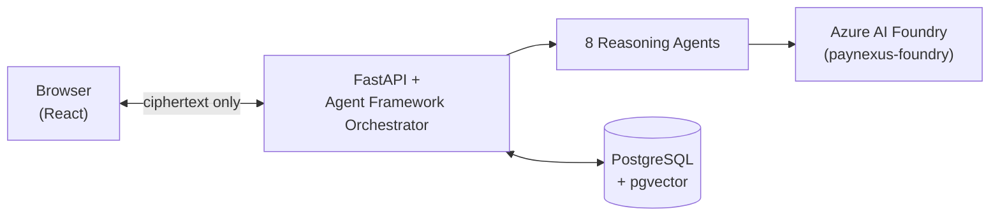

# PayNexus

> "Your pay, explained. Your finances, guided."

An AI assistant for salaried employees in India. Eight specialised agents sit behind one
orchestrator and cover payslips, tax rules, spending, budgets, savings goals, what-if planning and a
monthly recap.

**Live app: [PayNexus V2.1](https://ambitious-pebble-083cdaf10.7.azurestaticapps.net)** · API: `paynexus-api-v2.azurewebsites.net`

| Version | What it is | Status |
|---|---|---|
| **V2.1** (this branch, `foundry-v2`) | 8 agents on Microsoft Agent Framework and Azure AI Foundry | **Live and active** |
| V2 | 7 agents on LangGraph and direct OpenAI: bank statements, budgets, goals, what-if | Replaced by V2.1 |
| V1 | 3 agents: payslip, tax rules, savings nudges. [Frontend](https://nice-desert-0837ea310.7.azurestaticapps.net) only; backend stopped to save hosting cost | Frozen |

## How it evolved

**V2.1** moved V2's orchestrator from LangGraph to Microsoft's Agent Framework, running on Azure
AI Foundry. Only the agent layer changed. The FastAPI app, auth and encrypted storage stayed as they
were. It then kept growing: an eighth agent (Monthly Digest), ML transaction categorisation, spending
trend charts, live goal valuation, manual cash entry, credit-card billing cycles, and a hardened
CI and infrastructure pipeline. See [Beyond the original scope](#beyond-the-original-scope-v21).

**V2** took V1's design to a much bigger scope without redesigning the orchestration: bank
statements, budgets, savings goals and scenario planning, 7 agents in total. It ran on its own Azure
resources, so V1 was never at risk.

**V1** stayed small on purpose: three agents on a LangGraph orchestrator calling OpenAI directly.

Once V2.1 matched V2 and went further, keeping both was pure overhead. The V2 branch was removed, and
`foundry-v2` is now the only branch.

## Architecture

Two things drive most of the design decisions below: **every number a user sees traces to a Python
function, never an LLM's arithmetic** (tax slabs, deduction gaps, trends, overspending, goal
progress — computed once, quoted by whichever agent needs them), and **the server never sees
plaintext financial data** — payslip, financial-profile, bank-statement, goal, and budget rows are
all AES-256-GCM ciphertext end to end, encrypted/decrypted only in the browser.


```mermaid
graph LR
    User["Browser<br/>(React)"] <-->|ciphertext only| Backend
    Backend["FastAPI +<br/>Agent Framework Orchestrator"] --> Agents["8 Reasoning Agents"]
    Agents --> Foundry["Azure AI Foundry<br/>(paynexus-foundry)"]
    Backend <--> DB[("PostgreSQL<br/>+ pgvector")]
```

The Orchestrator (`agents/orchestrator_v2.py` — an Agent Framework structured-output intent
classifier plus plain `asyncio.gather` for the fan-out, as of the V2.1 migration below) classifies
each question and fans it out — concurrently — to whichever
of the eight agents actually apply; a payslip question hits one agent, "which regime should I pick
and how much would I save, and am I still on budget" might hit four. An explicit whole-picture
request ("how did I do this month?") is routed to the Monthly Digest agent *alone*, since it already
synthesizes what the individual agents would each say. Requests that try to add/edit/
delete saved data through chat (not a question, an instruction) are caught by a dedicated no-LLM
capability-gap node instead of being silently misrouted or hallucinated as done.

| Agent | Model (Foundry deployment) | Job |
|---|---|---|
| Payslip Reasoning | gpt-4o | Explains a specific payslip's numbers — accuracy over cost, since a wrong tax figure directly misleads someone |
| Regulatory Intelligence | Hybrid (gpt-4.1-mini / local Ollama) | Rule/threshold questions, grounded in `rag_documents/` via pgvector retrieval — never sees the user's actual salary |
| Savings Advisor (Nudge) | Hybrid | Cross-session pattern recognition — deduction headroom, trends, regime timing — using compressed session history |
| SpendingAnalyser | gpt-4o | Bank-statement transactions: category breakdowns, recurring merchants, the subscriptions-specific filter |
| BudgetPlanner | Hybrid | Actual spend vs. saved per-category budget targets — period-prorated so a statement longer than a month doesn't falsely read as overspending |
| GoalTracker | Hybrid | Savings-goal progress and whether the current pace hits a target date |
| Foresight (What-If) | gpt-4o | Explicit hypotheticals — "what if I switched regime / cut my budget by ₹1,000 / saved ₹500 more toward a goal / contributed 2% more to PF" |
| Monthly Digest | gpt-4o | One flowing recap across payslip trends, spending, budget, and goals. Never sees a raw statement — it only weaves together figures Python already computed, so it adds no new source of numbers |

A user never has to ask to be warned, either — client-side, no-LLM proactive alerts (ITR deadline,
regime-declaration window, deduction headroom, stale payslip/statement, over-budget category,
approaching goal deadline) surface unprompted as dismissible banners, dismissal scoped per-day per
alert via `localStorage`.

## Deployment

| Resource | What | Where |
|---|---|---|
| `paynexus-api` | V1 backend, Docker container | Azure App Service (Basic B1, `indiasouthcentral`) |
| `paynexus-api-v2` | V2 backend, Docker container — **same App Service Plan as V1** (shared compute, no extra plan cost) | Azure App Service (Free F1, `indiasouthcentral`) |
| `paynexus-web` | V1 frontend | Azure Static Web Apps (Free tier) |
| `paynexus-web-v2` | V2 frontend | Azure Static Web Apps (Free tier) |
| `paynexus-db-ramya` | PostgreSQL 16 + `pgvector`, separate `paynexus` (V1) / `paynexus_v2` (V2) databases on the same server | Azure Database for PostgreSQL Flexible Server (Burstable B1MS) |
| `ramya192/paynexus-backend` | Backend container image — `:latest`/`:<sha>` tags for V1, `:v2-latest`/`:v2-<sha>` for V2, same repo | Docker Hub (free tier) |

**Infrastructure as code.** `infra/v2-core.bicep` defines the App Service Plan, `paynexus-api-v2`,
`paynexus-web-v2`, Application Insights and its Log Analytics workspace. The Postgres server and the
Foundry stack are set up by hand (the file header says why).
- Validate without deploying: `az bicep build --file infra/v2-core.bicep`
- **CI never applies it.** A deploy is a deliberate `az deployment group create` run by a person. It
  has been used for one real deploy (see Observability below).
- Rollback steps (Docker re-tag and re-push, or a Static Web Apps re-deploy) are in `infra/ROLLBACK.md`.

**CI/CD.** Two independent workflows, so V1 and V2.1 builds never trigger each other.

| Workflow | Runs on push to | Deploys |
|---|---|---|
| `.github/workflows/deploy.yml` | `main` | `paynexus-api`, `paynexus-web` (V1) |
| `.github/workflows/deploy-v2.yml` | `foundry-v2` | `paynexus-api-v2`, `paynexus-web-v2` (V2.1) |

- **Blocking gates:** `pytest` with coverage, and the frontend `npm test`. A failing test stops the deploy.
- **Reported, not blocking:** `pip-audit` (dependency CVEs), `bandit` (this repo's own code) and
  `Trivy` (container OS CVEs). They post to the run summary so a new finding never blocks a deploy
  without a human decision.
- **Images:** both backends push to `ramya192/paynexus-backend` on Docker Hub (`:latest` for V1,
  `:v2-latest` for V2.1). Each App Service has its own webhook that re-pulls only its own tag. Docker
  Hub webhooks are not tag-scoped, so a push pings both apps and the other one restarts needlessly,
  which is harmless.
- **Webhook setup:** "SCM Basic Auth Publishing Credentials" must be enabled in the App Service
  configuration, or the webhook URL can't be retrieved.
- **Separate database:** V2.1 uses `paynexus_v2`, not V1's. A schema that is still changing should
  never write into the store V1 uses.

**Account Aggregator (AA): not shipped.** Automatic bank-statement fetch through Setu's Account
Aggregator works against Setu's sandbox (consent, data fetch, transaction mapping) on a separate
branch (`aa-sandbox-integration`). It is not merged or deployed. Two things block production:
- Setu's sandbox data-retrieval endpoint sometimes hangs after a fetch completes (raised with Setu).
- Going live needs registration as a financial-information user, and there is no self-serve route
  for an individual developer.

Until then, statements are uploaded as CSV or PDF.

**No "forgot password" flow, by design.** Every payslip, profile, transaction, goal and budget row is
encrypted with an AES-256-GCM key derived from the user's password (PBKDF2 plus a server-issued
salt). The server holds nothing that could recover that key, so a reset would have to do one of two things:
- **Orphan the data:** a new password derives a different key, so every existing row becomes unreadable.
- **Give the server a recovery secret:** then the server could decrypt user data, which breaks the
  promise that it never sees plaintext.

Password managers make the same trade-off. The fix would be a key-wrapping layer plus a one-time
recovery code shown once at registration. That is planned future work.

## Agent Framework migration (V2.1)

V2's LangGraph orchestrator was replaced with Microsoft's **Agent Framework**, running on **Azure AI
Foundry**. Only the agent layer changed: FastAPI, auth and encrypted CRUD are untouched. It runs the
live `/chat` endpoint (`api/routes/chat.py`), verified against a running server, not just unit tests.

**Two deliberate choices**
- **Orchestration: plain `asyncio.gather`, not `ConcurrentBuilder`.** The first version used the
  library's `ConcurrentBuilder`, with each agent wrapped in a custom `Executor` so that, for example,
  Regulatory Intelligence never sees financial data. With 2 agents it **deadlocked inside the live
  uvicorn server** (no output for 90+ seconds) yet ran fine in an isolated script. The shipped design
  keeps Agent Framework for `FoundryChatClient` calls and Pydantic structured output (including the
  intent classifier), and runs the selected agents with `asyncio.gather` over `asyncio.to_thread`.
  Same real concurrency, one code path for one agent or several, and `agent-framework-orchestrations`
  is no longer a dependency.
- **Runtime client: `FoundryChatClient` on a real Foundry project**, not the simpler
  `OpenAIChatClient` with an API key. That needed a Foundry Agent Service capability host (Storage,
  Cosmos DB serverless, AI Search Free tier), because the Responses API stores conversation state.

**Problems found and fixed along the way**
1. **Empty `403` from the Foundry gateway** that survived every RBAC fix. The Agent Service capability
   host had never been provisioned. Found by comparing a plain account-level call (worked) with a
   project-scoped one (failed).
2. **Contentless answers under load.** Foundry's shared GlobalStandard tier occasionally returned a
   schema-valid but empty completion. It happened 0 of 8 times in isolation and persisted after
   tripling capacity, so it is a load trait, not a prompt bug. A retry now checks for an actual ₹
   figure rather than response length.
3. **The `ConcurrentBuilder` deadlock** above, found by reproducing it on the real server. Dropping the
   workflow engine also fixed an earlier bug where state passed as JSON lost its `LLMCallMetrics`
   typing, since `asyncio.gather` returns real Python objects.
4. **Net pay had no computed figure.** "What would my net pay be if I contributed 2% more to PF?" had no
   real answer: the LLM was narrating take-home in its own words, the exact failure the tax modules
   were built to avoid. The new `payslip_math.py` (`compute_net_pay`, `compute_gross_pay`) fixes it in
   two places:
   - Payslip Reasoning now cites an exact computed ₹ figure, plus a net-pay trend across saved months.
   - A fourth What-If domain: the model extracts the percentage, Python does the rupee arithmetic.

   Verified live: a 2% PF increase on a ₹70,000 basic gave a ₹1,400/month net-pay drop and the matching
   old-regime tax change, both checked by hand against the slab math.

Every agent's JSON contract is now a Pydantic model (`response.value` is an already-validated
instance), and the intent classifier lost its manual JSON parsing the same way.

## Beyond the original scope (V2.1)

Added after V2.1 reached parity with V2, all under the same rule as everything else here: the number
comes from Python, the model only narrates it.

- **ML categorization tier.** Transactions are categorized by keyword rules first, then a
  confidence-gated TF-IDF + `LogisticRegression` tier, then the LLM as the last fallback
  (`categorization/ml_classifier.py`). Nothing is persisted: bank data is ciphertext at rest, so the
  frontend sends a sample of the user's own already-decrypted history with each request, the model is
  fit and used inside that one call, and it is discarded on return. It skips itself below 20 labeled
  examples or fewer than 2 categories, and defers to the LLM below 0.6 predicted probability.
- **Spending-trend projection + charts.** `analytics/trend_projection.py` fits a least-squares line
  (`scikit-learn`) once there are at least 3 periods of history — with fewer, a line fits perfectly
  and means nothing, so it returns nothing instead. Rendered as real charts in the UI (`recharts`).
- **Live goal valuation.** A savings goal can be linked to a fixed deposit (compound-interest math,
  quarterly compounding, no network call) or a mutual fund (real daily NAV via `mfapi.in`, which
  republishes AMFI data). Individual stocks were deliberately left out — FDs and mutual funds cover the
  real case. A failed price lookup leaves that one goal's live value blank rather than breaking the tab.
- **Monthly Digest agent** (the eighth agent above) and **payslip what-if math** (`payslip_math.py`,
  described in the migration section).

**Future work:** voice input (Whisper) and receipt image parsing (GPT-4V). Manual cash entry covers
the same need for now.

## Stack

| Area | Choice | Why |
|---|---|---|
| Orchestration | Agent Framework structured-output classifier + `asyncio.gather` fan-out (V2.1; V2 used LangGraph `StateGraph`; `ConcurrentBuilder` was tried and removed) | Real concurrent fan-out without the workflow engine that deadlocked under uvicorn |
| Frontend | React 19 + TypeScript + Vite | Current stable, fast dev loop |
| Styling | Tailwind v4, CSS-first via `@theme` | No separate config file, current major version |
| Frontend state | Zustand | One small store per concern (auth, chat, goals, budget, statements, alerts UI, …) |
| Charts | Recharts | Spending breakdowns and trend projection |
| Classical ML | scikit-learn (logistic regression, linear regression), NumPy | Small, explainable models where an LLM call would be slower and costlier |
| Encryption | Client-side AES-256-GCM (PBKDF2-derived key) | Server never sees plaintext financial data |
| Vector store | pgvector on the same Postgres instance | One database instead of a separate vector service |
| LLM provider | Azure AI Foundry (gpt-4o / gpt-4.1-mini via Agent Framework's `FoundryChatClient`; V2 called OpenAI directly), local Ollama fallback for hybrid agents | Genuine Foundry Agent Service integration — see migration section above |
| Statement ingestion | CSV parsed directly (no LLM); PDF text extracted client-side (pdfjs-dist) and structured via gpt-4o-mini (gpt-4.1-mini on Foundry) | The PDF itself never reaches the server, only extracted text does |
| Frontend testing | Vitest + React Testing Library | 306 tests (stores, API layer, all components) — see Testing below |

## Testing

- **Backend: 509 pytest tests** (490 offline, 19 live), run with `cd backend && pytest`. They cover
  bugs found across all versions: tax slab math, deduction gaps, trends, compression, table dedup,
  budget period-proration, duplicate transaction IDs, Ollama's markdown-fenced JSON, and the
  concurrent fan-out. The 19 `@pytest.mark.integration` tests call real Foundry/OpenAI.
- **Coverage: 80.0% branch** on the offline tier (`pytest --cov=.`, config in `.coveragerc`),
  measured on application code only. It undercounts: agents' LLM-call bodies run only in the live
  tests, which CI skips without credentials. Reported on every CI run.
- **Frontend: 306 Vitest and React Testing Library tests** (`npm test`), a blocking CI gate. They cover
  all 10 Zustand stores, all 8 API modules (including the hand-rolled SSE stream parser) and all 27
  components, asserting on real branch conditions rather than snapshots. Writing them found real bugs:
  - a raw prorated float leaking into three UI surfaces (fixed everywhere the pattern appeared);
  - a credit-card retry flow with a stale, still-clickable Save button and an inverted error condition
    that hid the failure message;
  - seven components with no `htmlFor`/`id` label association, so screen readers announced no label.
- **Evals**
  - `backend/rag/eval.py`: **94% hit-rate, 0.853 MRR, 94% keyword coverage** against a hand-verified
    ground-truth set.
  - `backend/agent_eval/eval.py`: keyword coverage plus forbidden-phrase checks (a confidently wrong
    conclusion despite correct numbers). **10 hand-verified cases, 100% pass, 0 forbidden phrases.**
    A small set, so read it as a regression guard, not broad accuracy.
  - `backend/compression/eval.py`: real before and after token cost for context compression.
- **`paynexus-v2.1-test-suite`** (a separate local project, not in this repo): live end-to-end tests
  against a running backend and real Foundry. Covers routing for every agent, privacy isolation
  between agents, tax-regime math checked by hand against Budget 2025-26, What-If, duplicate detection,
  and regressions for a Foundry hang and a regulatory cache false positive. Deliberately not mocked.

## Performance

Real timed `/chat` calls against the live backend, small samples on purpose since every call costs money.

| | Sample | Median | Range |
|---|---|---|---|
| Single-agent turn (classifier + 1 agent) | n=8 | **8.1s** | 6.7s to 9.2s, plus one 26.6s cold-start outlier |
| Multi-agent turn (classifier + 3 agents, concurrent) | n=4 | **8.5s** | 7.4s to 12.8s |

A 3-agent turn is barely slower than a 1-agent turn, which shows the fan-out really runs in parallel:
latency is roughly the slowest agent, not the sum. The cold-start outlier is the first call after an
idle period on Foundry's GlobalStandard tier, not a fan-out cost.

## Unit economics

One measured single-agent turn, from the app's own per-call tracking (`agents/llm_metrics.py`, using
the provider's `response.usage`, never estimated):

| Call | Model | Tokens (in/out) | Cost |
|---|---|---|---|
| Intent classifier | gpt-4o | 1,865 / 8 | $0.00474 |
| Regulatory agent (the 1 selected agent) | gpt-4.1-mini | 1,959 / 27 | $0.00083 |
| **Total** | | | **$0.00557 (~₹0.47)** |

**The classifier costs more than the answer.** It runs on gpt-4o for accuracy and is a fixed cost per
turn, however many agents are selected. Each extra agent adds roughly $0.0008 to $0.005 depending on
its tier, so a 3-agent turn lands around **$0.011 to $0.016 (~₹0.9 to 1.3)**, extrapolated from the
same per-call pricing rather than a second live measurement.

## Observability

The performance and cost figures above are one-off measurements. This adds a live view of the app.

- **Application Insights, off by default.** `api/main.py` calls `configure_azure_monitor()` only when
  `APPLICATIONINSIGHTS_CONNECTION_STRING` is set, so local, CI and test runs are unaffected. When on,
  it instruments FastAPI latency, status and exceptions, and outbound `httpx` calls, with no per-route code.
- **Provisioned with Bicep.** `infra/v2-core.bicep` declares the Application Insights resource and its
  Log Analytics workspace. They were **deployed for real** by hand and checked with a live
  `POST /auth/register`, which confirmed every other app setting survived. Both stay free at this
  traffic (5GB/month ingestion grant). The deploy surfaced two region bugs that `az bicep build` and
  `what-if` missed:
  - Log Analytics and Static Web Apps have never been available in `indiasouthcentral`, so the
    observability resources use `centralindia`.
  - The live frontend had been running in **Central US** all along.
- **Two more CI scans, non-blocking** (they report; a new finding shouldn't silently block a deploy):
  - `bandit` scans this repo's own Python. Its first run found a SHA1 dedup fingerprint in
    `models.py`, fixed with `usedforsecurity=False` rather than suppressed. Two other Low findings were
    reviewed and are not issues.
  - `Trivy` scans the built container image for OS-level CVEs.
- **`infra/ROLLBACK.md`** gives rollback steps: re-tag and re-push the last good Docker image (or point
  the App Service at it with `az webapp config container set`), or re-run a past Static Web Apps
  deployment. It also states what it does not cover: no automated rollback trigger and no database
  down-migration.

## Security review

A focused pass against the actual route code, using OWASP API Top 10 as the checklist.

**Checked and solid**
- **Object-level authorization (API1):** every goal, budget, statement and payslip route checks
  `resource.user_id != current_user.id` (16 checks, confirmed by `grep`), so guessing an ID reaches
  nothing.
- **CORS:** `allow_origins` comes from `CORS_ORIGINS`, defaults to `localhost`, and is never a wildcard.
- **Auth:** `bcrypt` password hashing, 60-minute JWTs, and the same error for "no such user" and
  "wrong password" (no user enumeration).

**Found and fixed**
- **No rate limiting on `/auth/login` and `/auth/register` (API4).** Added `slowapi` limits in
  `security/rate_limit.py`: 10/minute for login and 5/minute for register. Tests actually trigger a 429
  (`tests/test_auth_routes.py`).
- **No static analysis of our own code.** `pip-audit` covers only dependencies, so `bandit` was added to CI
  (see Observability).

**Found and disclosed, no fix exists**
- **`ecdsa` 0.19.2 Minerva timing-attack CVE** (`PYSEC-2026-1325`), a transitive dependency. Upstream
  says side-channel attacks are out of scope and plans no fix. Practical risk is low, since it needs
  sustained local access to the signing operation. `pip-audit` now reports it on every CI run.

**Not done:** a full penetration test, SSRF and injection fuzzing, and a formal threat model.

## Layout

```
paynexus-v2.1/
├── backend/
│   ├── agents/          Agent Framework orchestrator (orchestrator_v2.py) + 8 reasoning agents
│   ├── agent_eval/       answer-quality eval harness
│   ├── analytics/        spending trends, trend projection, goal progress, live FD/MF valuation
│   ├── budgeting/        budget vs. actual-spend checks
│   ├── categorization/   rules → logistic-regression tier → LLM fallback
│   ├── ingestion/        CSV statement parsing
│   ├── rag/              retriever, index builder, eval harness
│   ├── compression/      context compression + its eval harness
│   ├── security/         auth, password hashing
│   ├── db/                SQLAlchemy models, session handling
│   ├── tests/             509 pytest tests
│   ├── alembic/          migrations — alembic upgrade head before first run
│   ├── Dockerfile         real, tested container for App Service
│   └── ...                FastAPI app, statement/payslip extraction, tax computation modules
├── frontend/              React 19 + TypeScript + Tailwind v4 (Vite) — 306 Vitest tests (stores,
│                          API layer, all 27 components), `npm test`
│   └── src/components/    Auth, Dashboard (tabs), Chat, ChatWidget, Alerts, GoalTracker,
│                          BudgetPlanner, StatementUploader, PayslipUploader, FinancialProfile
├── infra/                 v2-core.bicep (App Service, Static Web App, App Insights) + ROLLBACK.md
├── rag_documents/         Indian tax-law source docs embedded into pgvector
└── .github/workflows/     CI/CD to Azure (Docker Hub + Static Web Apps) — `deploy-v2.yml` watches `foundry-v2`
```

## Quick start

Needs `backend/.env` filled in (copy `backend/.env.example`) — `OPENAI_API_KEY` (still used by
extraction/categorization helpers outside the 7 orchestrator agents), `FOUNDRY_PROJECT_ENDPOINT`
(the Azure AI Foundry project the 7 agents actually call), and a `DATABASE_URL` pointing at a
Postgres with the `vector` extension enabled (`CREATE EXTENSION IF NOT EXISTS vector;`). Foundry
auth is via `DefaultAzureCredential` — run `az login` once locally before starting the backend;
there's no separate Foundry API key to set.

```bash
# backend
cd backend
python -m venv .venv && .venv\Scripts\activate
pip install -r requirements.txt
alembic upgrade head        # schema setup — required once, before first run
python -m rag.build_index   # only needed once, or after editing rag_documents/
uvicorn api.main:app        # no --reload: it silently misses edits on Windows, so restart after changes

# frontend
cd frontend
npm install
npm run dev
```
